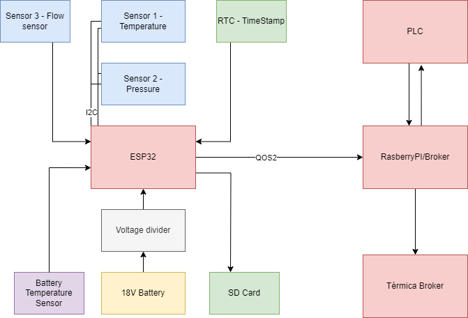
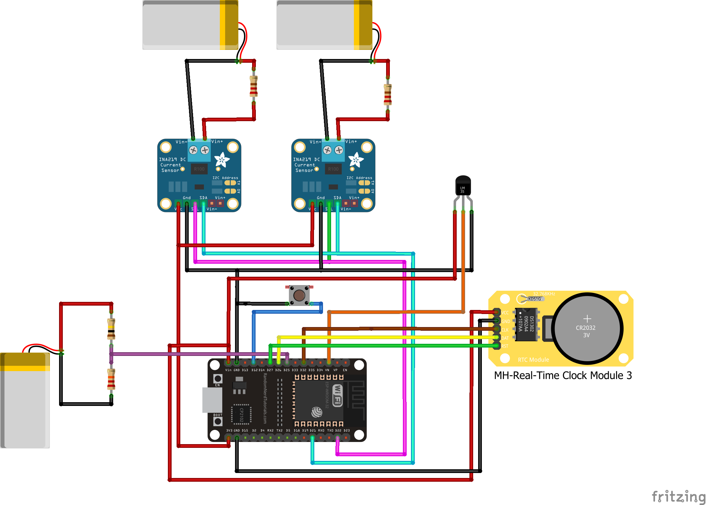

# EnGlobeProject

## Project Overview

The EnGlobeProject is an ESP32-based system designed to collect readings from various sensors and publish these readings to an MQTT broker. This project is suitable for monitoring environmental conditions or as a starting point for more complex IoT setups.

## Table of Contents

1. [Description](#description)
2. [Hardware Requirements](#hardware-requirements)
3. [Hardware Setup](#hardware-setup)
4. [Required Software](#required-software)
5. [Software Setup](#software-setup)
6. [Running the Project](#running-the-project)
7. [Troubleshooting](#troubleshooting)
8. [Contributing](#contributing)
9. [License](#license)
10.[Handling the Pi](#handling-the-Pi)

## Description

This project is an ESP32-based system that collects readings from various sensors and publishes these readings to an MQTT broker.

## Hardware Requirements

This project utilizes the following hardware components:

1. **ESP32:** This is the microcontroller running the main code. It communicates with all sensors and modules and sends the sensor data via MQTT.
2. **INA219 Bi-directional DC Current/Power Monitor Modules:** Two of these modules are used in this project to monitor power and current. They are connected to the ESP32 via the I2C interface. Be sure to connect VCC to 3.3V, GND to GND, SDA to GPIO21 (or the GPIO you have defined as SDA), and SCL to GPIO22 (or the GPIO you have defined as SCL).
3. **Temperature Sensor:** This sensor is used to measure the temperature. Connect its data pin to the appropriate GPIO pin on the ESP32 as defined in your code.
4. **DS1302 Real Time Clock (RTC) Module:** This module provides accurate timekeeping for timestamping the sensor data. Connect the CLK, DAT, and RST pins of the DS1302 module to the GPIO pins defined in your code, and VCC and GND to the power supply.
5. **Button**.

Please ensure all your wiring connections are secure and correct to prevent any malfunctioning or damage to your devices. If you're not using a breadboard or PCB for your project, it's a good idea to use a multimeter to check that your connections are correct before powering up the ESP32.

## Hardware Setup

The following hardware components are required for this project:

1. ESP32 development board
2. Two INA219 Current Sensor modules
3. One Temperature Sensor (Please replace with your specific model)
4. DS1302 Real-Time Clock (RTC) module

### ESP32 Connections

- Connect the LED to the GPIO 2 on the ESP32.
- Connect the interruption input to GPIO 12 on the ESP32.

### INA219 Current Sensor Module Connections

- Connect the INA219 modules to the I2C pins on the ESP32. 
- SCL pin 22
- SDA pin 21
- Make sure the power (VCC 3.3v) and ground (GND) pins are also connected.

### Temperature Sensor Connections

- Connect your specific temperature sensor to the appropriate pins on the ESP32, pin 39(somethimes called VN.)

### DS1302 Real-Time Clock (RTC) Module Connections

- Connect the DS1302 RTC module to the SPI pins on the ESP32. This typically involves connecting the MOSI, MISO, and SCK.
- CLK pin 32.
- DAT pin 26.
- RST pin 27.
- Make sure the power (VCC 3.3v) and ground (GND) pins are also connected.

### Button 
- Connect the **button** in GND and Pin 13.

## Required Software

- Visual Studio Code
- PlatformIO IDE extension for VS Code

## Software Setup

This project requires the following software tools:

1. Visual Studio Code
2. PlatformIO IDE extension for Visual Studio Code
3. Git
4. GitHub extension for Visual Studio Code to view the printed messages and debug information.

## Running the Project

To compile, upload, and run the project on your ESP32, follow these steps:

1. Open the main project file in PlatformIO.
2. Click on the checkmark icon in the lower toolbar to compile the code. Ensure there are no errors reported in the console.
3. Connect your ESP32 to your computer via USB.
4. Click on the right arrow icon in the lower toolbar to upload the code to your ESP32.
5. Open the Serial Monitor

### Visual Studio Code Installation

1. Visit the [official Visual Studio Code download page](https://code.visualstudio.com/download).
2. Download the version of Visual Studio Code suitable for your operating system.
3. Run the downloaded file and follow the installation prompts.

###quote("## Software Setup\n\nThis project", "Visual Studio Code\n\n1. Visit the [official Visual Studio Code download page](https://code.visualstudio.com/download).\n2. Download the version of Visual Studio Code suitable for your operating system.\n3. Run the downloaded file and follow the installation prompts.")

### PlatformIO IDE Extension Installation

1. Open Visual Studio Code.
2. Click on the Extensions button on the left sidebar or press `Ctrl+Shift+X` to open the Extensions pane.
3. Search for "PlatformIO".
4. Click on the Install button next to "PlatformIO IDE".

### Git Installation

1. Visit the [official Git download page](https://git-scm.com/downloads).
2. Download the version of Git suitable for your operating system.
3. Run the downloaded file and follow the installation prompts.

### GitHub Extension for Visual Studio Code Installation

1. Open Visual Studio Code.
2. Click on the Extensions button on the left sidebar or press `Ctrl+Shift+X` to open the Extensions pane.
3. Search for "GitHub".
4. Click on the Install button next to "GitHub".

## Code Structure

The project is organized into several directories, each containing different aspects of the code:

- **src:** Contains the main.cpp file, which is the entry point for the program. This file includes the header files from the lib directory and orchestrates the overall functioning of the program.
- **lib:** Contains the custom libraries used in this project. Each library is organized into its own directory within lib. The libraries include:
    - **General_Utils:** Contains utility functions used across the project, such as a function for blinking the LED and a function for formatting the sensor readings into a string for publishing.
    - **MQTT_Handler:** Contains functions for handling MQTT connections and publishing messages.
    - **Sensors:** Contains functions for reading sensor data.
    - **Timestamp:** Contains functions for working with timestamps.

## Usage

After setting up the hardware and installing the required software, follow these steps to run the project:

1. Clone this GitHub repository to your local machine.
2. Open the project folder in Visual Studio Code.
3. Build the project by clicking on the checkmark icon at the bottom of the PlatformIO IDE toolbar on the left side of the VS Code window.
4. Connect your ESP32 to your computer via a USB cable.
5. Upload the program to the ESP32 by clicking on the right arrow icon at the bottom of the PlatformIO IDE toolbar.
6. Open the Serial Monitor by clicking on the plug icon at the bottom of the PlatformIO IDE toolbar to view the sensor readings.

## Troubleshooting

If you encounter any issues during the setup or running of the project, consider the following troubleshooting steps:

1. Double-check your hardware connections to ensure they are correct and secure.
2. Verify that all required libraries are installed correctly.
3. Ensure that you have selected the correct board and settings in PlatformIO.
4. Check for any error messages or warnings in the PlatformIO console or Serial Monitor.

If the issue persists, you can search for solutions or ask for help in relevant forums or communities. Provide as much detail as possible about the problem and any error messages you encountered.

## Contributing

Contributions to the EnGlobeProject are welcome! If you have any improvements, bug fixes, or new features to add, please follow these steps:

1. Fork the repository on GitHub.
2. Create a new branch with a descriptive name for your changes.
3. Make your modifications and ensure that the code is working properly.
4. Commit your changes and push them to your forked repository.
5. Open a pull request in the original repository, explaining your changes and their purpose.

## License

This project is licensed under the MIT License. See the LICENSE file in the project root for more information.

## Handling the Pi

Headless 32-bit image

#Requiriments:

Docker container running a mosquitto broker inside (friendly reminder to update the .config to add the lines:
allow_anonymous true and listenes 1883)

#What is happening on the Pi?

The Local Broker is the key point to exchange the data. 
There is a MQTTpubsub.py

Based on it, there are three differente cases:

1. Data comming from the ESP32 (sensors) and going to the Termica Broker 

2. Data comming from a PLC and going to the Termica Broker

3. Getting data from the ESP32 (sensors) and writing it to a PLC

In cases 1 and 2, data is being publish via MQTT to two different topics on the Broker:
esp32/# and plc/#. The esp32 publishing part 

To get this data from the Local Broker and send to Termica Broker, there is a script called 
mqttClientServer.py inside the folder pi_codes. The requirements of this code is the paho.mqtt 
python library installed on your enviroment, saving that, no change should be necessary.

To simulate the data comming from the PLC the program Prosys OPC UA Simulator is needed.
Inside, a folder enGlobe_test should be created and the following variables:

- Flowmeter_sensor
- Pressure_sensor
- Temperature_sensor
- 

Inside the folder OPC_UA there is a script called OPC_client_subscription.py responsiable for 
getting data from the simulator and sending to the pi Local Broker.

Inside this script is necessary to identify the IP of the machine where the simulator is running.

After having all the enviroments and right network IPs the codes are ready to run.

#Some hints

Please remember that the Broker IP Addr is the same as the machine running the broker (no need 
if you use "localhost" in the codes)

To check the connection with Termica Broker, open a new terminal in a machine with the right 
mqtt-client packages installed (the pi will also do) and run:

$mosquitto_sub -h 3.16.161.137 -t "#" -u "data" -P "datapasswd"

To subscribe to all the topics

