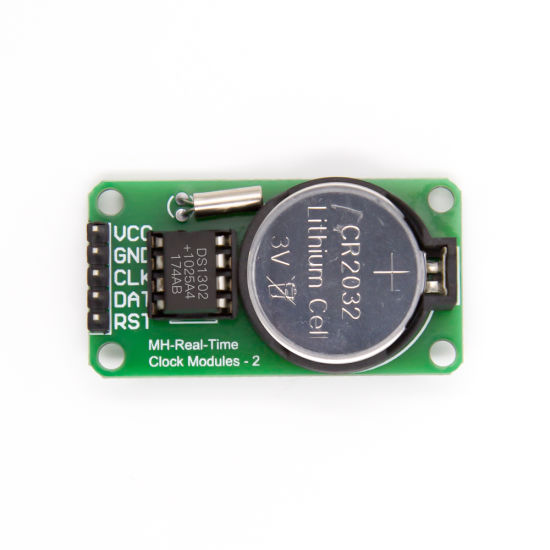

# EnGlobeProject

## Project Overview

The EnGlobeProject is a robust, ESP32-based IoT solution designed to gather and process data from various sensors, including power/current monitoring modules and temperature sensors. It leverages the power of MQTT protocol to efficiently publish sensor readings to an MQTT broker. This project can serve as a sophisticated environment monitoring system or as a foundation for more intricate IoT applications. It also features real-time clock capabilities for precise timestamping of sensor data, and a user-input button for additional functionality.

This project is structured to provide a clear understanding of the hardware-software interaction, enhancing its maintainability and scalability. It is well-suited for applications requiring real-time monitoring of multiple environmental parameters.


## Table of Contents

1. [Description](#description)
2. [Hardware Requirements](#hardware-requirements)
3. [Understanding the INA219 and I2C](#Understanding-the-INA219-and-I2C)
4. [Hardware Setup](#hardware-setup)
5. [Required Software](#required-software)
6. [Software Setup](#software-setup)
7. [Running the Project](#running-the-project)
8. [Troubleshooting](#troubleshooting)
9. [Contributing](#contributing)
10. [License](#license)
11. [Handling the Pi](#handling-the-Pi)


## Description

The EnGlobeProject is an IoT system built on the ESP32 microcontroller platform. It interfaces with multiple sensors, including INA219 Bi-directional DC Current/Power Monitor Modules for power and current monitoring, a temperature sensor for ambient temperature readings, and a DS1302 Real Time Clock (RTC) module for accurate timekeeping and timestamping of sensor data. The system also includes a button for user interaction.

The ESP32 microcontroller collects readings from these sensors and publishes the data to an MQTT broker, enabling real-time tracking and analysis of environmental conditions. The project's software architecture is modular, with dedicated libraries for handling MQTT connections, sensor data readings, timestamp management, and general utilities. This architecture allows for easy modification and expansion to accommodate additional sensors or functionality.

Whether you're looking to monitor environmental conditions in a specific location, or building the foundation for a larger IoT system, the EnGlobeProject provides a versatile and powerful platform to meet your needs.

## Hardware Requirements

This project utilizes the following hardware components:

1. **ESP32:** This is the microcontroller running the main code. It communicates with all sensors and modules and sends the sensor data via MQTT. 
2. **INA219 Bi-directional DC Current/Power Monitor Modules:** Two of these modules are used in this project to monitor power and current. They are connected to the ESP32 via the I2C interface. Be sure to connect VCC to 3.3V, GND to GND, SDA to GPIO21 (or the GPIO you have defined as SDA), and SCL to GPIO22 (or the GPIO you have defined as SCL)..
3. **Temperature Sensor: LM35** This sensor is used to measure the temperature. Connect its data pin to the appropriate GPIO pin on the ESP32 as defined in your code.   
4. **DS1302 Real Time Clock (RTC) Module:** This module provides accurate timekeeping for timestamping the sensor data. Connect the CLK, DAT, and RST pins of the DS1302 module to the GPIO pins defined in your code, and VCC and GND to the power supply.  
5. **Button**. 


Please ensure all your wiring connections are secure and correct to prevent any malfunctioning or damage to your devices. If you're not using a breadboard or PCB for your project, it's a good idea to use a multimeter to check that your connections are correct before powering up the ESP32.

## Understanding the INA219 and I2C

The INA219 is a high-side current shunt and power monitor with an I2C interface. It's used in this project to measure power and current. The INA219 monitors both shunt drop and supply voltage, allowing you to calculate power usage. This module has a programmable calibration register, allowing for a wide range of currents to be measured.

The I2C interface of the INA219 is used for communication with the ESP32. I2C, or Inter-Integrated Circuit, is a multi-master, multi-slave, packet-switched, single-ended, serial computer bus. It allows multiple devices to be connected to the ESP32's I2C bus, each with a unique address recognized by the ESP32.

### I2C Addressing

Each INA219 board must be assigned a unique I2C address. The I2C base address for each board is 0x40. The binary address that you program with the address jumpers is added to the base I2C address. Here is the addressing scheme:

 

- Board 0: Address = 0x40 Offset = binary 00000 (no jumpers required)
- Board 1: Address = 0x41 Offset = binary 00001 (bridge A0 as in the photo above)
- Board 2: Address = 0x44 Offset = binary 00100 (bridge A1)
- Board 3: Address = 0x45 Offset = binary 00101 (bridge A0 & A1)

The information was obtained from this [website](https://learn.adafruit.com/adafruit-ina219-current-sensor-breakout/assembly).

Here is the complete INA219 I2C Address table:

| A1 | A0 | Slave Address |
| --- | --- | --- |
| GND | GND | 1000000 |
| GND | V S+ | 1000001 |
| GND | SDA | 1000010 |
| GND | SCL | 1000011 |
| V S+ | GND | 1000100 |
| V S+ | V S+ | 1000101 |
| V S+ | SDA | 1000110 |
| V S+ | SCL | 1000111 |
| SDA | GND | 1001000 |
| SDA | V S+ | 1001001 |
| SDA | SDA | 1001010 |
| SDA | SCL | 1001011 |
| SCL | GND | 1001100 |
| SCL | V S+ | 1001101 |
| SCL | SDA | 1001110 |
| SCL | SCL | 1001111 |

Please refer to the [INA219 datasheet](https://www.ti.com/lit/ds/symlink/ina219.pdf?ts=1631885952561&ref_url=https%253A%252F%252Fwww.google.com%252F) for more detailed information on I2C addressing and how to set up and use the INA219 module.


## Hardware Setup

The following hardware components are required for this project:

1. ESP32 development board
2. Two INA219 Current Sensor modules
3. One Temperature Sensor LM35
4. DS1302 Real-Time Clock (RTC) module


### INA219 Current Sensor Module Connections

- Connect the INA219 modules to the I2C pins on the ESP32.
- SCL pin **22**
- SDA pin **21**
- Make sure the power (VCC **3.3v**) and ground (**GND**) pins are also connected.

### Temperature Sensor Connections

- Connect your specific temperature sensor to the appropriate pins on the ESP32, pin **39** (sometimes called VN).
- Make sure the power (VCC **3.3v**) and ground (**GND**) pins are also connected.

### DS1302 Real-Time Clock (RTC) Module Connections

- Connect the DS1302 RTC module to the SPI pins on the ESP32. This typically involves connecting the MOSI, MISO, and SCK.
- CLK pin **32**.
- DAT pin **26**.
- RST pin **27**.
- Make sure the power (VCC **3.3v**) and ground (**GND**) pins are also connected.

### Button

- Connect the **button** in **GND** and Pin **13**.


## Required Software

- [Visual Studio Code](https://code.visualstudio.com/): The code editor used for this project.
- [PlatformIO for VSCode](https://platformio.org/install/ide?install=vscode): An extension for VSCode that makes it easy to develop for the ESP32 and other microcontrollers.

## Software Setup

This project requires the following software tools:

1. Visual Studio Code
2. PlatformIO IDE extension for Visual Studio Code
3. Git
4. GitHub extension for Visual Studio Code to view the printed messages and debug information.

## Running the Project

To compile, upload, and run the project on your ESP32, follow these steps:

1. Open the main project file in PlatformIO.
2. Click on the checkmark icon in the lower toolbar to compile the code. Ensure there are no errors reported in the console.
3. Connect your ESP32 to your computer via USB.
4. Click on the right arrow icon in the lower toolbar to upload the code to your ESP32.
5. Open the Serial Monitor

### Visual Studio Code Installation

1. Visit the [official Visual Studio Code download page](https://code.visualstudio.com/download).
2. Download the version of Visual Studio Code suitable for your operating system.
3. Run the downloaded file and follow the installation prompts.

###quote("## Software Setup\n\nThis project", "Visual Studio Code\n\n1. Visit the [official Visual Studio Code download page](https://code.visualstudio.com/download).\n2. Download the version of Visual Studio Code suitable for your operating system.\n3. Run the downloaded file and follow the installation prompts.")

### PlatformIO IDE Extension Installation

1. Open Visual Studio Code.
2. Click on the Extensions button on the left sidebar or press `Ctrl+Shift+X` to open the Extensions pane.
3. Search for "PlatformIO".
4. Click on the Install button next to "PlatformIO IDE".

#### Locating Main Code Files

The main code files are located in the `src` directory of your PlatformIO project. 

#### Setting the Baud Rate for the Serial Monitor

1. Open your `platformio.ini` file.
2. Locate the line with `monitor_speed`(sometimes you need to add this line).
3. Set the value to the desired baud rate. For example, `monitor_speed = 115200` sets the baud rate to 115200.

#### Compiling the Code

1. Open the PlatformIO home.
2. Navigate to your project.
3. Click on the "Build" button (check mark icon).

#### Viewing the Serial Monitor 

1. Ensure your ESP32 is connected to your computer.
2. Open the PlatformIO home.
3. Navigate to your project.
4. Click on the "Serial Monitor" button (plug icon).

### Git Installation

1. Visit the [official Git download page](https://git-scm.com/downloads).
2. Download the version of Git suitable for your operating system.
3. Run the downloaded file and follow the installation prompts.

### GitHub Extension for Visual Studio Code Installation

1. Open Visual Studio Code.
2. Click on the Extensions button on the left sidebar or press `Ctrl+Shift+X` to open the Extensions pane.
3. Search for "GitHub".
4. Click on the Install button next to "GitHub".

## Code Structure

The project is organized into several directories, each containing different aspects of the code:

- **src:** Contains the main.cpp file, which is the entry point for the program. This file includes the header files from the lib directory and orchestrates the overall functioning of the program.
- **lib:** Contains the custom libraries used in this project. Each library is organized into its own directory within lib. The libraries include:
    - **General_Utils:** Contains utility functions used across the project, such as a function for blinking the LED and a function for formatting the sensor readings into a string for publishing.
    - **MQTT_Handler:** Contains functions for handling MQTT connections and publishing messages.
    - **Sensors:** Contains functions for reading sensor data.
    - **Timestamp:** Contains functions for working with timestamps.

## Usage

After setting up the hardware and installing the required software, follow these steps to run the project:

1. Clone this GitHub repository to your local machine.
2. Open the project folder in Visual Studio Code.
3. Build the project by clicking on the checkmark icon at the bottom of the PlatformIO IDE toolbar on the left side of the VS Code window.
4. Connect your ESP32 to your computer via a USB cable.
5. Upload the program to the ESP32 by clicking on the right arrow icon at the bottom of the PlatformIO IDE toolbar.
6. Open the Serial Monitor by clicking on the plug icon at the bottom of the PlatformIO IDE toolbar to view the sensor readings.

## Troubleshooting

If you encounter any issues during the setup or running of the project, consider the following troubleshooting steps:

1. Double-check your hardware connections to ensure they are correct and secure.
2. Verify that all required libraries are installed correctly.
3. Ensure that you have selected the correct board and settings in PlatformIO.
4. Check for any error messages or warnings in the PlatformIO console or Serial Monitor.

If the issue persists, you can search for solutions or ask for help in relevant forums or communities. Provide as much detail as possible about the problem and any error messages you encountered.

## Contributing

Contributions to the EnGlobeProject are welcome! If you have any improvements, bug fixes, or new features to add, please follow these steps:

1. Fork the repository on GitHub.
2. Create a new branch with a descriptive name for your changes.
3. Make your modifications and ensure that the code is working properly.
4. Commit your changes and push them to your forked repository.
5. Open a pull request in the original repository, explaining your changes and their purpose.


## License

This project is licensed under the MIT License. See the LICENSE file in the project root for more information.

## Raspberry Pi Setup and Operation

This section explains how to handle the Raspberry Pi with a headless 32-bit image and the use of a Docker container.

### Requirements:

- Docker container running a Mosquitto broker. Remember to update the Mosquitto configuration file with these lines:
```
allow_anonymous true
listener 1883
```

### Overview of the Raspberry Pi Operations:

The local broker in the Raspberry Pi is a key point for data exchange, and there is a `MQTTpubsub.py` script which orchestrates it. Based on this script, there are three different cases:

1. Data coming from the ESP32 (sensors) and going to the Termica Broker.
2. Data coming from a Programmable Logic Controller (PLC) and going to the Termica Broker.
3. Data from the ESP32 (sensors) being written to a PLC.

In cases 1 and 2, data is being published via MQTT to two different topics on the broker: `esp32/#` and `plc/#`. 

To get this data from the Local Broker and send it to Termica Broker, there is a script called `mqttClientServer.py` inside the `pi_codes` folder. The requirements of this script is the `paho.mqtt` Python library installed on your environment. Other than that, no changes should be necessary.

To simulate the data coming from the PLC, the Prosys OPC UA Simulator is needed. Inside the simulator, a folder `enGlobe_test` should be created and include the following variables:

- `Flowmeter_sensor`
- `Pressure_sensor`
- `Temperature_sensor`


Inside the `OPC_UA` folder, there is a script called `OPC_client_subscription.py` responsible for getting data from the simulator and sending it to the Pi's local broker. 

In this script, it is necessary to identify the IP of the machine where the simulator is running. After setting up all the environments and ensuring the correct network IPs, the codes are ready to run.

### Useful Tips

- The broker IP address is the same as the machine running the broker (you can also use "localhost" in the codes).
- To check the connection with the Termica Broker, open a new terminal in a machine with the correct mqtt-client packages installed (the Pi will also do), and run the following command:

```bash
mosquitto_sub -h 3.16.161.137 -t "#" -u "data" -P "datapasswd"
```

This command subscribes to all the topics on the broker.
